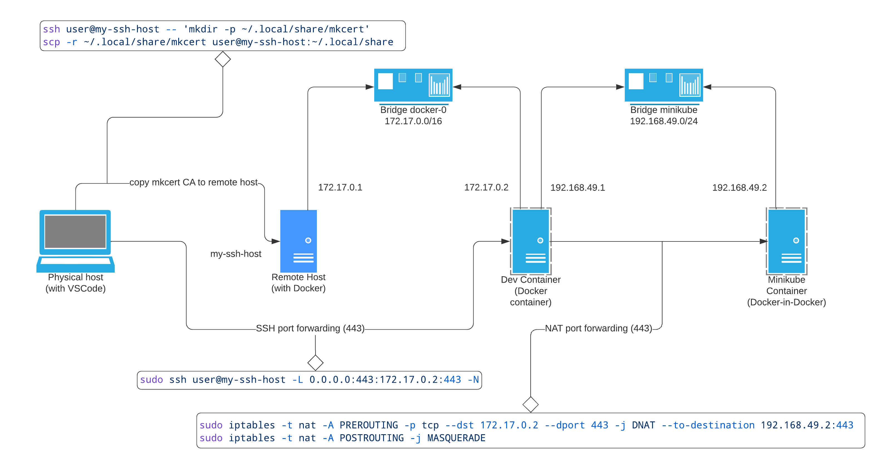
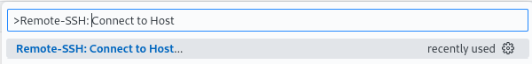
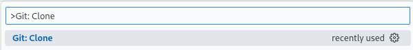
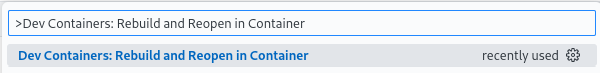
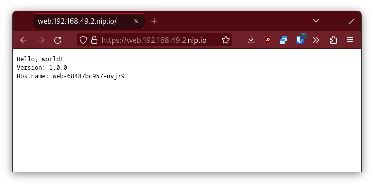

# Minikube in a (remote) Dev Container



## Configure *mkcert*

[Install *mkcert*](https://github.com/FiloSottile/mkcert#installation) on the physical host (the one with the Web Browser) then create a root <abbr title="Certificate Authority">CA</abbr>:

```shell
# on physical host
mkcert -install
```

> This command will add the CA in detected browsers (Chrome, Firefox, ...), system trust store, Java trust store, ...

**If the Dev Container run on a remote host**, copy the *mkcert* directory to this host:

```shell
# on physical host
VSCODE_SSH_HOST=user@my-ssh-host # can also reference a host from ~/.ssh/config
ssh $VSCODE_SSH_HOST -- 'mkdir -p ~/.local/share/mkcert'
scp -r ~/.local/share/mkcert $VSCODE_SSH_HOST:~/.local/share
```

## Start the Dev Container

Start VSCode:
```shell
# on physical host
code .
```

> **If using a remote host**, press Ctrl+Shift+P and select *Remote-SSH: Connect to Host...* to connect :
> 

Clone this repository (press Ctrl+Shift+P and select *Git: Clone*) :



Press Ctrl+Shift+P and select *Dev Containers: Rebuild and Reopen in Container* :



## Forward traffic

**If the Dev Container run on a remote host**, it is required to forward the traffic from the physical host (the one with the Web Browser) to the Dev Container running Minikube.

Create a dummy interface with the Minikube IP (*192.168.49.2* by default):

```shell
# on physical host
sudo ip link add minikube type dummy
sudo ip addr add 192.168.49.2/32 dev minikube
```

Then forward only this IP:

```shell
# on physical host
MINIKUBE_IN_DOCKER_IP=$(ssh $VSCODE_SSH_HOST -- ip -4 neigh show dev docker0 | awk '{print $1}') # 172.17.0.2 in this example
sudo ssh $VSCODE_SSH_HOST -L 192.168.49.2:443:$MINIKUBE_IN_DOCKER_IP:443 -N
```

Verify you can ping the Minikube IP using *nip.io*:

```shell
# on physical host
ping 192.168.49.2.nip.io
```

> If not, you might check on your router or ISP whether a [DNS rebind protection](https://en.wikipedia.org/wiki/DNS_rebinding#Protection) is enabled.

## Test with a deployment/service/ingress

Create a sample *Deployment*, expose it as a *Service* and create an *Ingress* to route the traffic from a hostname at Minikube IP:

```shell
# in Dev Container
kubectl create deployment web --image=gcr.io/google-samples/hello-app:1.0
kubectl expose deployment web --port 8080
kubectl create ingress web --rule="web.$(minikube ip).nip.io/*=web:8080"
```

The Web service is now available at https://web.192.168.49.2.nip.io

